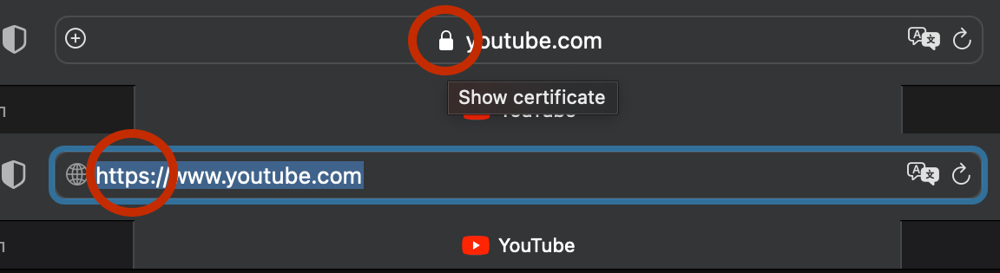

 # ИТОГОВЫЙ проект

## Задание 1.  Определите, на каком протоколе работает сайт youtube.com

Сайт youtube.com работает на протоколе https. В этом можно убедиться по наличию пиктограмы с замком в адресной строке бразуера, а также по указанию этого протокола в адресе самого сайта.

## Задание 2. Создайте файл 2_analyze.txt, в котором проанализируйте структуру страницы сайта https://ru.wikipedia.org/, а именно нужно описать (коротко, своими словами), какие блоки есть на сайте, что в этих блоках находится. Есть ли на сайте шапка, подвал, что в них содержится? Как и где расположен контент? Есть ли дополнительные элементы на странице?

Заглавная страница сайта https://ru.wikipedia.org/ делится на две неравные части - левый сайдбар и область основного контента.

Левый сайдбар, меньшая из частей, в верхней части содержит кликабельный логотип, который ведет на заглавную страницу, а так же навигационные ссылки на разделы и инструменты работы с сайтом - форум, переключение языка, экспорт и .т.д.

Область контента в верхней части содержит хедер с разделом авторизации, поиском по сайту, функциональными переключателями режима отображения информации (читать, просмотр кода, история и .т.п.)

Ниже хедера располагается приветственная плашка на всю ширину области контента с приветствием пользователя, краткой справочной информацией по порталу, активной кнопкой, позволяющей пользователю создать статью.

Контент располагается ниже приветственной плашки, распределен по двум равным по ширине колонкам в области контента. Заглавная страница заполняется периодически сменяемыми материалами. Каждый из материалов содержится в отдельном фрейме с обозначенными границами и отступом содержимого от границ фрейма.

Каждый фрейм может содержать как текстовую информацию, так и изображения в комбинациях. В конце фрейма содержится активная кнопка, осуществляющая переход на страницу, содержащую статью. 

Область контента закрывается подвалом. Подвал области контента содержит информацию по сайтам сообщества, представленную в виде логотипов с ссылками. 

В нижней части страницы - футтер заглавной страницы. Он содержит служебную информацию, ссылки на нормативные документы и логотипы используемых технологий.

Примечание: текстовый файл не создавал за ненадобностью.

## Задание 3. Внесите не менее 10 изменений на страницу любой статьи сайта https://ru.wikipedia.org/, с помощью инструмента разработчика и представьте два скриншота было/стало (скриншоты должны иметь названия 3_before.jpg, 3_after.jpg соответственно). Желательно поработать с изменением текста на странице, заменой картинки, изменением стилей.

Страница ресурса до внесения изменений:

Страница ресурса после внесения изменений:

## Задание 4. Создайте прототип низкой детализации сайта https://dzen.ru/ с помощью сайта https://wireframe.cc/. Предоставьте скриншот того, что получилось (скриншот должен быть назван 4_proto.jpg).

Прототип низкой детализации:

